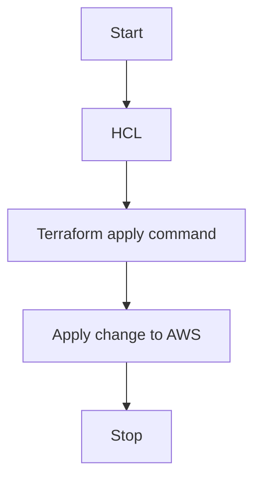
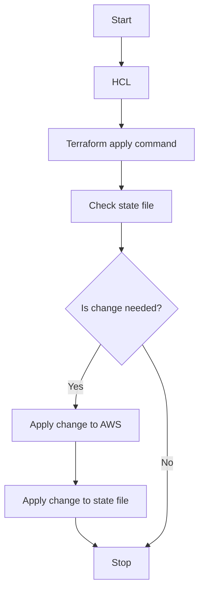
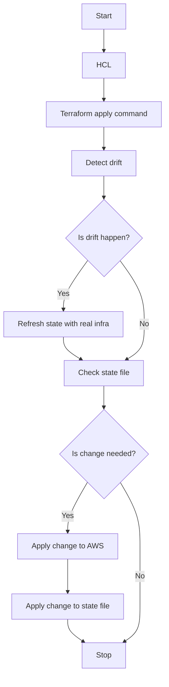

# Terraform state file 

The basic usage of terraform is to use a configuration language called HCL to describe the infrastructure through code. Basically, I can write whatever infrastructure needed in the HCL as a resource.

```
resource "aws_vpc" "vpc1" {
  ...
}

resource "aws_vpc" "vpc2" {
  ...
}
```

This infrastructure will be created on AWS when I run the `terraform apply` command. I have taken AWS as an example here, but this is true for any terraform supported provider like Azure, GCP, on premises and many more.



Terraform apply command is idempotent. That means, if I run the command multiple times then it first checks the existing infrastructure and then apply only the change which is needed. In other words, if there is no change in the HCL then terraform will not apply any changes in the AWS even if I run the apply command multiple times.

But for every apply command checking the real infrastructure is not efficient sometimes. To overcome this problem, terraform internally uses a state file. The state file has all the resources with every property in it which denotes the real infrastructure. At the time of apply, terraform first checks the HCL with state file instead of the real infrastructure to understand what the changes are needed to be applied. If there are any changes which are needed to be applied, then terraform apply those in AWS and then update the state file as well.



## Refresh state file

If I update the real infrastructure manually bypassing the HCL configuration, then terraform state file becomes outdated. The next time when I run the apply command, terraform first try to update the state file with the real infrastructure to make it up to date. This is called drift detection.



When the infrastructure become big with many resources then this drift detection does not happen. In that case the state file is only single source of truth. So, it is not recommended to update the AWS infra bypassing the HCL and terraform apply command.
